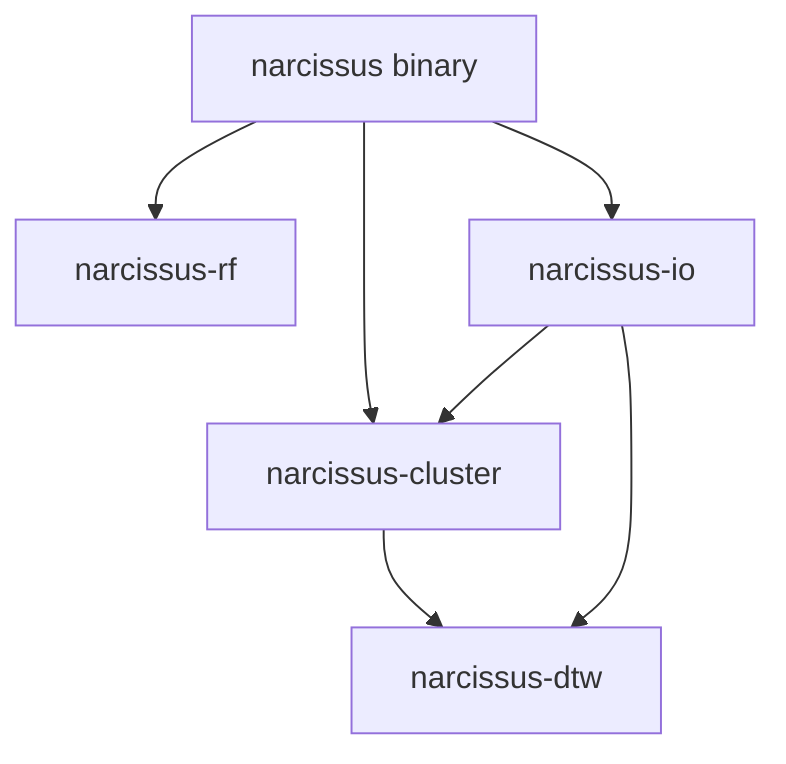

# Narcissus

High-performance Rust CLI for shape-based hydrological basin clustering and classification.

Clusters basins by streamflow shape using Dynamic Time Warping, then trains a Random Forest to predict cluster membership from static attributes. Every algorithm is hand-rolled for throughput. Every command emits structured JSON to stdout, making the tool composable and LLM-drivable.

> **Based on:** Yang & Olivera (2023) — *"Classification of watersheds in the conterminous United States using shape-based time-series clustering and Random Forests."*

## Quick Start

```bash
# Build
cargo build --release

# 1. Find the best cluster count (elbow method)
narcissus optimize \
  --data streamflow.csv \
  --min-k 4 --max-k 20 \
  --experiment run1 \
  --output-dir results/

# 2. Cluster at the chosen k
narcissus cluster \
  --data streamflow.csv \
  --k 12 \
  --experiment run1 \
  --output-dir results/

# 3. Train & evaluate a Random Forest classifier
narcissus evaluate \
  --data streamflow.csv \
  --attributes basin_attrs.csv \
  --k 12 \
  --experiment run1 \
  --output-dir results/

# 4. Predict cluster membership for new basins
narcissus predict \
  --model results/run1_model.bin \
  --attributes new_basins.csv \
  --experiment run1 \
  --output-dir results/
```

All output goes to stdout as JSON. Diagnostics go to stderr via `tracing`.

## Architecture

```
narcissus (workspace root)
├── Cargo.toml              # workspace manifest
├── crates/
│   ├── narcissus-dtw/      # DTW distance + DBA barycenter averaging
│   ├── narcissus-cluster/  # K-means loop, initialization, elbow optimization
│   ├── narcissus-rf/       # Random Forest: train, evaluate, predict, serialize
│   └── narcissus-io/       # CSV readers, JSON writers, validation
├── src/
│   └── main.rs             # CLI (clap subcommands)
└── docs/
    └── userguide.md        # Full usage reference
```



| Crate | Role |
|---|---|
| **narcissus-dtw** | Pure math. DTW distance, Sakoe-Chiba constraint, DBA barycenter averaging. Zero I/O. |
| **narcissus-cluster** | DTW K-means with k-means++ init, multi-restart, elbow optimization. |
| **narcissus-rf** | CART decision trees, Random Forest ensemble, stratified CV, OOB, feature importance, bincode serialization. |
| **narcissus-io** | CSV readers, JSON writers, parse-don't-validate domain types, basin/attribute alignment. |

## Key Design Decisions

- **All algorithms hand-rolled** — no `smartcore`, no `linfa`. Full control over parallelism and memory.
- **Rayon everywhere** — pairwise DTW, K-means restarts, tree training, batch prediction.
- **Deterministic** — `ChaCha8Rng` seeded from `--seed` (default 42). Same input + same seed = same output.
- **Type-driven** — newtypes (`BasinId`, `ClusterLabel`, `Inertia`, `DtwDistance`), enums over booleans, parse-don't-validate at I/O boundaries.
- **JSON to stdout, diagnostics to stderr** — every command is pipeable and parseable.
- **Bincode model format** — versioned envelope for forward compatibility.

## Documentation

- [User Guide](docs/userguide.md) — full CLI reference, input formats, output schemas, pipeline walkthrough
- [narcissus-dtw README](crates/narcissus-dtw/README.md) — DTW crate architecture and glossary
- [narcissus-cluster README](crates/narcissus-cluster/README.md) — clustering crate architecture and glossary

## License

MIT
