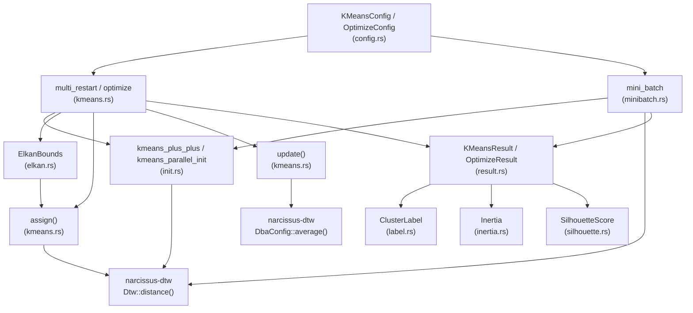

# narcissus-cluster

DTW-based K-means clustering for time series data. Accepts a slice of
[`TimeSeries`](../narcissus-dtw) values, clusters them into _k_ groups using
Dynamic Time Warping as the distance metric, and returns assignments and DBA
centroids. Initialization uses either k-means++ or K-Means|| (Bahmani et al.
2012) to reduce the risk of poor local minima; a configurable number of
independent restarts are run in parallel (via Rayon) and the best result
(lowest inertia) is returned. Elkan's triangle inequality acceleration skips
unnecessary DTW computations during assignment, and PrunedDTW with precomputed
centroid envelopes further reduces cost. The `OptimizeConfig` entry-point
sweeps a range of _k_ values with distance matrix caching and collects the
full inertia curve, enabling elbow-method cluster count selection.
`MiniBatchConfig` offers an online variant that updates centroids on random
subsets with a decaying learning rate for faster convergence on large datasets.
Post-clustering quality can be assessed via silhouette coefficient computation.

---

## Architecture



### Module summary

| Module | Responsibility |
|---|---|
| `config.rs` | `KMeansConfig`, `OptimizeConfig`, `MiniBatchConfig`, and `InitStrategy` builders; the public `fit()` entry-points |
| `kmeans.rs` | Core EM loop (`assign`, `update`), `multi_restart`, `optimize` sweep; dispatches on `InitStrategy`, integrates PrunedDTW with precomputed `SeriesEnvelope`, distance matrix caching in `optimize()` |
| `init.rs` | K-means++ seeding, `kmeans_parallel_init()` (K-Means||), and `kmeans_plus_plus_cached()` for distance matrix reuse |
| `elkan.rs` | Elkan's triangle inequality acceleration — upper/lower bounds to skip unnecessary DTW computations |
| `minibatch.rs` | Mini-batch K-means — online centroid updates on random subsets, faster convergence on large datasets |
| `silhouette.rs` | Silhouette coefficient computation — per-sample, per-cluster, and mean clustering quality scores |
| `result.rs` | `KMeansResult`, `OptimizeResult`, `KResult`; helpers `cluster_sizes`, `members`, `best_k` |
| `label.rs` | `ClusterLabel` newtype — zero-based cluster index, comparable and displayable |
| `inertia.rs` | `Inertia` newtype — total sum of squared DTW distances; total-ordering comparator |
| `error.rs` | `ClusterError` enum — `InvalidK`, `TooFewSeries`, `InvalidKRange`, `EmptyCluster`, `BatchTooLarge`, `Dba` |

---

## Glossary

| Term | Meaning |
|---|---|
| **DTW** | Dynamic Time Warping — elastic distance metric that aligns time series by warping the time axis |
| **DBA** | DTW Barycenter Averaging — iterative algorithm (Petitjean et al. 2011) that computes a centroid under DTW alignment |
| **Inertia** | Sum of squared DTW distances from each series to its assigned cluster centroid; lower is better |
| **k-means++** | Seeding heuristic: first centroid chosen uniformly at random; subsequent centroids chosen with probability proportional to the squared distance to the nearest already-chosen centroid |
| **K-Means||** | Scalable initialization (Bahmani et al. 2012): O(log k) oversampling rounds sampling candidates with D^2 probability, then reduce to k centers via weighted k-means++ |
| **Elkan's algorithm** | K-means variant using triangle inequality: maintains upper bound (to assigned centroid) and lower bounds (to all centroids) per series. Skips DTW when bounds prove the assignment cannot change |
| **Mini-batch K-means** | K-means with online updates: each iteration samples a mini-batch, assigns to nearest centroid, updates centroids with decaying learning rate 1/count |
| **Silhouette coefficient** | Clustering quality metric: s(i) = (b(i) - a(i)) / max(a(i), b(i)), where a(i) = mean intra-cluster distance, b(i) = mean nearest-cluster distance. Range [-1, 1], higher is better |
| **Distance matrix caching** | Precompute all n(n-1)/2 pairwise DTW distances once; reused across k values in `optimize()` and for cached k-means++ initialization |
| **Centroid envelope** | Precomputed `SeriesEnvelope` for each centroid, recomputed after each DBA update, used for LB_Keogh pruning in `assign()` |
| **Multi-restart** | Running K-means from `n_init` independent random seeds and keeping the run with the lowest inertia |
| **Elbow method** | Plot inertia vs. _k_; the "elbow" (maximum second derivative) marks the point of diminishing returns |
| **Band constraint** | Sakoe-Chiba radius _r_: restricts DTW warping path to a band of width `2r+1` around the diagonal |
| **Empty cluster rescue** | When a cluster loses all members during an iteration, the series farthest from its centroid in the largest cluster is moved to the empty cluster |
| **ChaCha8Rng** | Cryptographically seeded, deterministic PRNG used so that results are reproducible given the same seed |

---

## Key types

### Entry points

| Type | Where | Purpose |
|---|---|---|
| [`KMeansConfig`] | `config.rs` | Configure and run K-means for a fixed _k_. Chain `with_*` methods, then call `.fit(&series)` |
| [`OptimizeConfig`] | `config.rs` | Sweep `[min_k, max_k]` and return the full inertia curve for elbow analysis |
| [`MiniBatchConfig`] | `config.rs` | Configure and run mini-batch K-means. Chain `with_*` methods, then call `.fit(&series)` |

### Results

| Type | Where | Purpose |
|---|---|---|
| [`KMeansResult`] | `result.rs` | Best clustering result: assignments, centroids, inertia, convergence flag |
| [`OptimizeResult`] | `result.rs` | Ordered `Vec<KResult>` (one per _k_); exposes `best_k()` for elbow detection |
| [`KResult`] | `result.rs` | `(k, inertia)` pair for a single _k_ value in an optimize sweep |

### Supporting types

| Type | Where | Purpose |
|---|---|---|
| [`InitStrategy`] | `config.rs` | Initialization enum: `KMeansPlusPlus` or `KMeansParallel { oversample_factor }` |
| [`SilhouetteScore`] | `silhouette.rs` | Clustering quality assessment: per-sample, per-cluster, and mean silhouette |
| [`SampleSilhouette`] | `silhouette.rs` | Per-sample silhouette value with cluster assignment |
| [`ClusterLabel`] | `label.rs` | Zero-based cluster index newtype; prevents confusion with series indices |
| [`Inertia`] | `inertia.rs` | Inertia value newtype with total-ordering comparison |
| [`ClusterError`] | `error.rs` | All failure modes from clustering operations |

---

## Quick example

```rust
use narcissus_dtw::{BandConstraint, TimeSeries};
use narcissus_cluster::{KMeansConfig, OptimizeConfig, InitStrategy, MiniBatchConfig};

let series: Vec<TimeSeries> = /* load your data */;

// Single k
let result = KMeansConfig::new(5, BandConstraint::SakoeChibaRadius(2))?
    .with_n_init(10)
    .with_seed(42)
    .fit(&series)?;

println!("inertia = {}", result.inertia);
println!("cluster sizes = {:?}", result.cluster_sizes());

// K-Means|| initialization
let result = KMeansConfig::new(5, BandConstraint::SakoeChibaRadius(2))?
    .with_init_strategy(InitStrategy::KMeansParallel { oversample_factor: 2.0 })
    .with_seed(42)
    .fit(&series)?;

// Mini-batch K-means
let result = MiniBatchConfig::new(5, BandConstraint::SakoeChibaRadius(2))?
    .with_batch_size(64)
    .with_n_init(3)
    .with_seed(42)
    .fit(&series)?;

// Elbow sweep
let opt = OptimizeConfig::new(2, 20, BandConstraint::SakoeChibaRadius(2))?
    .with_n_init(5)
    .with_seed(42)
    .fit(&series)?;

println!("suggested k = {:?}", opt.best_k());
```
