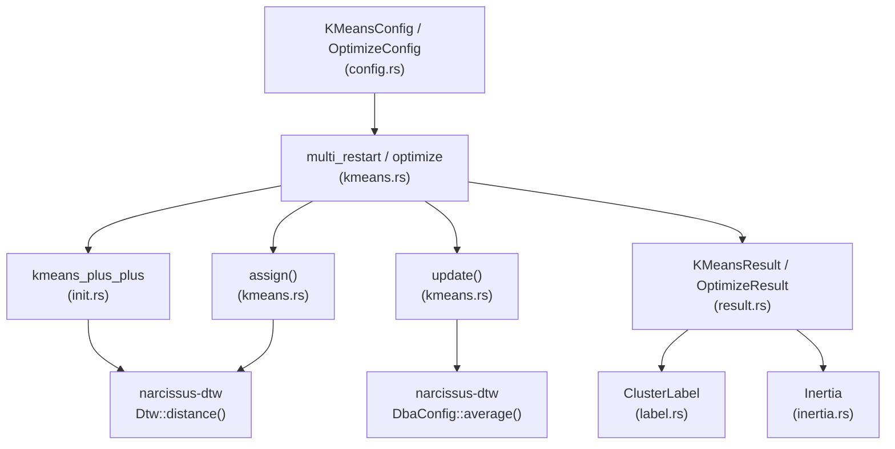

# narcissus-cluster

DTW-based K-means clustering for time series data. Accepts a slice of
[`TimeSeries`](../narcissus-dtw) values, clusters them into _k_ groups using
Dynamic Time Warping as the distance metric, and returns assignments and DBA
centroids. Initialization uses the k-means++ strategy to reduce the risk of
poor local minima; a configurable number of independent restarts are run in
parallel (via Rayon) and the best result (lowest inertia) is returned.
The `OptimizeConfig` entry-point sweeps a range of _k_ values and collects
the full inertia curve, enabling elbow-method cluster count selection.

---

## Architecture



### Module summary

| Module | Responsibility |
|---|---|
| `config.rs` | `KMeansConfig` and `OptimizeConfig` builders; the public `fit()` entry-points |
| `kmeans.rs` | Core EM loop (`assign`, `update`), `multi_restart`, `optimize` sweep |
| `init.rs` | K-means++ seeding — probabilistic centroid selection weighted by squared distance |
| `result.rs` | `KMeansResult`, `OptimizeResult`, `KResult`; helpers `cluster_sizes`, `members`, `best_k` |
| `label.rs` | `ClusterLabel` newtype — zero-based cluster index, comparable and displayable |
| `inertia.rs` | `Inertia` newtype — total sum of squared DTW distances; total-ordering comparator |
| `error.rs` | `ClusterError` enum — `InvalidK`, `TooFewSeries`, `InvalidKRange`, `EmptyCluster`, `Dba` |

---

## Glossary

| Term | Meaning |
|---|---|
| **DTW** | Dynamic Time Warping — elastic distance metric that aligns time series by warping the time axis |
| **DBA** | DTW Barycenter Averaging — iterative algorithm (Petitjean et al. 2011) that computes a centroid under DTW alignment |
| **Inertia** | Sum of squared DTW distances from each series to its assigned cluster centroid; lower is better |
| **k-means++** | Seeding heuristic: first centroid chosen uniformly at random; subsequent centroids chosen with probability proportional to the squared distance to the nearest already-chosen centroid |
| **Multi-restart** | Running K-means from `n_init` independent random seeds and keeping the run with the lowest inertia |
| **Elbow method** | Plot inertia vs. _k_; the "elbow" (maximum second derivative) marks the point of diminishing returns |
| **Band constraint** | Sakoe-Chiba radius _r_: restricts DTW warping path to a band of width `2r+1` around the diagonal |
| **Empty cluster rescue** | When a cluster loses all members during an iteration, the series farthest from its centroid in the largest cluster is moved to the empty cluster |
| **ChaCha8Rng** | Cryptographically seeded, deterministic PRNG used so that results are reproducible given the same seed |

---

## Key types

### Entry points

| Type | Where | Purpose |
|---|---|---|
| [`KMeansConfig`] | `config.rs` | Configure and run K-means for a fixed _k_. Chain `with_*` methods, then call `.fit(&series)` |
| [`OptimizeConfig`] | `config.rs` | Sweep `[min_k, max_k]` and return the full inertia curve for elbow analysis |

### Results

| Type | Where | Purpose |
|---|---|---|
| [`KMeansResult`] | `result.rs` | Best clustering result: assignments, centroids, inertia, convergence flag |
| [`OptimizeResult`] | `result.rs` | Ordered `Vec<KResult>` (one per _k_); exposes `best_k()` for elbow detection |
| [`KResult`] | `result.rs` | `(k, inertia)` pair for a single _k_ value in an optimize sweep |

### Supporting types

| Type | Where | Purpose |
|---|---|---|
| [`ClusterLabel`] | `label.rs` | Zero-based cluster index newtype; prevents confusion with series indices |
| [`Inertia`] | `inertia.rs` | Inertia value newtype with total-ordering comparison |
| [`ClusterError`] | `error.rs` | All failure modes from clustering operations |

---

## Quick example

```rust
use narcissus_dtw::{BandConstraint, TimeSeries};
use narcissus_cluster::{KMeansConfig, OptimizeConfig};

let series: Vec<TimeSeries> = /* load your data */;

// Single k
let result = KMeansConfig::new(5, BandConstraint::SakoeChibaRadius(2))?
    .with_n_init(10)
    .with_seed(42)
    .fit(&series)?;

println!("inertia = {}", result.inertia);
println!("cluster sizes = {:?}", result.cluster_sizes());

// Elbow sweep
let opt = OptimizeConfig::new(2, 20, BandConstraint::SakoeChibaRadius(2))?
    .with_n_init(5)
    .with_seed(42)
    .fit(&series)?;

println!("suggested k = {:?}", opt.best_k());
```
