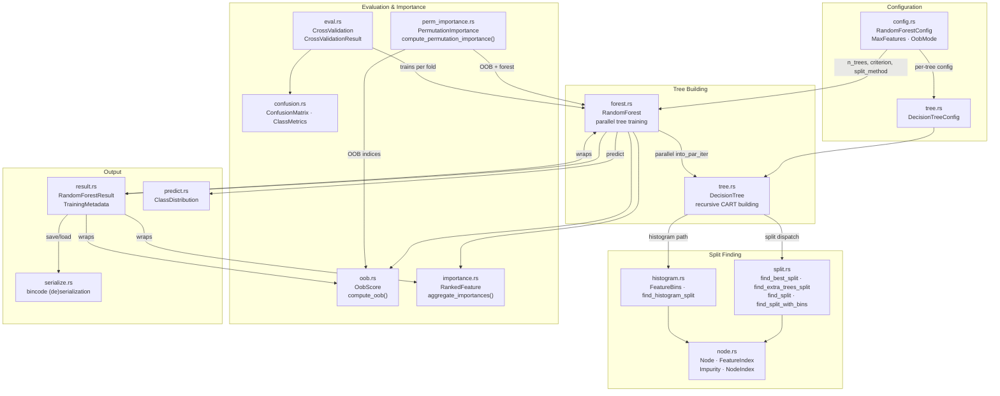

# narcissus-rf

Hand-rolled Random Forest classifier with CART decision trees. Supports multiple split strategies (exact CART, Extra-Trees, histogram-based), two impurity criteria (Gini, Entropy), parallel training via Rayon, out-of-bag evaluation, MDI and permutation feature importance, stratified k-fold cross-validation, and bincode model serialization.

---

## Architecture



Module dependency flow: `config.rs` feeds `RandomForestConfig` into `forest.rs`, which spawns parallel tree training via Rayon. Each `DecisionTree` delegates split finding to `split.rs` (exact CART, Extra-Trees) or `histogram.rs` (quantile-binned histogram splits), both backed by `node.rs` newtypes. After training, `forest.rs` computes MDI importances and optionally OOB evaluation. `eval.rs` orchestrates stratified k-fold cross-validation by training forests across folds. `result.rs` wraps the forest, importances, and metadata into a single `RandomForestResult`. `serialize.rs` handles bincode persistence.

---

## Module summary

| Module | Responsibility |
|---|---|
| `config.rs` | `RandomForestConfig` builder; `MaxFeatures`, `OobMode` enums; `fit()` entry point |
| `forest.rs` | `RandomForest` struct: parallel tree training, batch prediction, tree accessor |
| `tree.rs` | `DecisionTree` and `DecisionTreeConfig`: recursive CART tree building with configurable split strategy |
| `split.rs` | Split finding: exact CART O(n log n), Extra-Trees O(n), split criterion dispatch (Gini, Entropy) |
| `histogram.rs` | `FeatureBins` quantile binning, histogram-based split finding O(n + B) |
| `node.rs` | `Node` enum (Leaf/Internal), `FeatureIndex`, `Impurity`, `NodeIndex` newtypes |
| `importance.rs` | MDI (Mean Decrease in Impurity) feature importance + ranking |
| `perm_importance.rs` | Permutation feature importance: OOB accuracy drop when a feature is shuffled |
| `oob.rs` | Out-of-bag evaluation: per-tree OOB predictions aggregated into ensemble accuracy |
| `eval.rs` | `CrossValidation` config and `CrossValidationResult`: stratified k-fold CV |
| `confusion.rs` | `ConfusionMatrix` with per-class precision, recall, F1, support via `ClassMetrics` |
| `predict.rs` | `ClassDistribution`: per-sample probability distribution over classes |
| `result.rs` | `RandomForestResult`: trained forest + metadata (OOB score, importances, training stats) |
| `serialize.rs` | Bincode serialization with versioned envelope (FORMAT_VERSION = 1) |
| `error.rs` | `RfError` enum: validation and runtime errors |

---

## Glossary

| Term | Definition |
|---|---|
| CART | Classification and Regression Trees -- greedy top-down tree construction with optimal split search |
| Gini impurity | 1 - sum(p_c^2) -- measures class purity at a node |
| Entropy | -sum(p_c * ln(p_c)) -- information-theoretic impurity measure |
| MDI | Mean Decrease in Impurity -- feature importance computed as the weighted sum of impurity decreases across all tree splits |
| Permutation importance | Feature importance measured by the drop in OOB accuracy when a feature's values are randomly shuffled |
| OOB | Out-of-bag -- samples not in a tree's bootstrap sample, used for unbiased error estimation |
| Extra-Trees | Extremely Randomized Trees -- random threshold selection O(n) instead of optimal O(n log n) per feature |
| Histogram splitting | Quantile-bin features once, then scan bins O(B) per feature; total O(n + B) vs O(n log n) for exact |
| Bootstrap | Random sampling with replacement to create diverse training sets for each tree |
| max_features | Number of features randomly considered at each split: sqrt(n_features) by default |
| Stratified k-fold | CV that preserves class proportions in each fold |
| Bincode envelope | Versioned binary format: FORMAT_VERSION header + serialized forest payload |

---

## Key types

### Entry points

| Type | Where | Purpose |
|---|---|---|
| `RandomForestConfig` | `config.rs` | Configure RF: n_trees, max_depth, split_method, criterion, seed. Chain `with_*`, then `.fit()` |
| `DecisionTreeConfig` | `tree.rs` | Single-tree config: used internally by forest, but also public for standalone tree usage |
| `CrossValidation` | `eval.rs` | Configure stratified k-fold CV: n_folds, seed. Call `.evaluate()` with a `RandomForestConfig` |

### Result types

| Type | Where | Purpose |
|---|---|---|
| `RandomForestResult` | `result.rs` | Trained forest + OOB score + MDI importances + training metadata |
| `CrossValidationResult` | `eval.rs` | Per-fold accuracies, mean, std, confusion matrix, feature importances |
| `RandomForest` | `forest.rs` | The trained ensemble: `predict()`, `predict_batch()`, `predict_proba()` |

### Supporting types

| Type | Where | Purpose |
|---|---|---|
| `SplitMethod` | `split.rs` | Enum: `Exact`, `ExtraTrees`, `Histogram { n_bins }` |
| `SplitCriterion` | `split.rs` | Enum: `Gini`, `Entropy` |
| `MaxFeatures` | `config.rs` | Enum: `Sqrt`, `Log2`, `Fraction(f64)`, `Fixed(usize)`, `All` |
| `OobMode` | `config.rs` | Enum: `Enabled`, `Disabled` |
| `ConfusionMatrix` | `confusion.rs` | N x N matrix with per-class `ClassMetrics` (precision, recall, F1, support) |
| `PermutationImportance` | `perm_importance.rs` | Per-feature importance score with std and rank |
| `RankedFeature` | `importance.rs` | Feature name + MDI importance + rank |
| `OobScore` | `oob.rs` | OOB accuracy and sample count |
| `ClassDistribution` | `predict.rs` | Per-class probability vector for a single prediction |
| `RfError` | `error.rs` | All RF failure modes |

---

## Quick example

```rust
use narcissus_rf::{RandomForestConfig, SplitMethod, CrossValidation};

// Train a forest
let result = RandomForestConfig::new(100)?
    .with_split_method(SplitMethod::Histogram { n_bins: 256 })
    .with_seed(42)
    .fit(&features, &labels, &feature_names)?;

println!("OOB accuracy: {:?}", result.oob_score());
println!("Top features: {:?}", result.importances());

// Cross-validate
let cv = CrossValidation::new(5)?;
let rf_config = RandomForestConfig::new(100)?;
let cv_result = cv.evaluate(&rf_config, &features, &labels, &feature_names)?;
println!("CV accuracy: {:.3} +/- {:.3}", cv_result.mean_accuracy, cv_result.std_accuracy);
```
