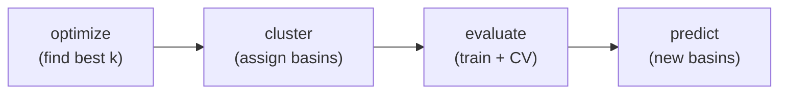

# Narcissus User Guide

Complete reference for the narcissus CLI. This document is optimized for LLM consumption — every flag, default, input format, and output schema is specified exactly once with no ambiguity.

## Table of Contents

- [Pipeline Overview](#pipeline-overview)
- [Installation](#installation)
- [Input Formats](#input-formats)
- [Commands](#commands)
  - [optimize](#optimize)
  - [cluster](#cluster)
  - [evaluate](#evaluate)
  - [predict](#predict)
- [Global Flags](#global-flags)
- [Clustering Tuning Flags](#clustering-tuning-flags)
- [Output Artifacts](#output-artifacts)
- [End-to-End Example](#end-to-end-example)
- [Determinism and Reproducibility](#determinism-and-reproducibility)
- [Error Reference](#error-reference)

---

## Pipeline Overview

Narcissus implements a four-stage pipeline. Each stage is an independent CLI subcommand. Stages compose through files on disk.



| Stage | Input | Output | Purpose |
|---|---|---|---|
| `optimize` | time series CSV | `_optimize.json` | Sweep k range, report inertia per k, detect elbow |
| `cluster` | time series CSV | `_cluster.json` | Cluster at a single k, save assignments + centroids |
| `evaluate` | time series CSV + attributes CSV | `_cluster.json`, `_evaluate.json`, `_model.bin` | Cluster, train RF on cluster labels + attributes, cross-validate, save model |
| `predict` | attributes CSV + `_model.bin` | `_predict.json` | Load saved model, predict cluster membership for new basins |

Stages 1-2 operate on time series only. Stage 3 bridges time series (for clustering) with static attributes (for classification). Stage 4 operates on attributes only.

---

## Installation

```bash
# Clone and build
git clone https://github.com/nicolaslazaro/narcissus.git
cd narcissus
cargo build --release

# Binary is at target/release/narcissus
```

Requires Rust 1.75+ (2021 edition, resolver v2).

---

## Input Formats

### Time Series CSV

One row per basin. First column is the basin identifier. Remaining columns are time steps (e.g., 52 weekly streamflow values).

```
basin_id,t0,t1,t2,...,t51
BASIN_001,0.12,0.15,0.18,...,0.11
BASIN_002,0.45,0.42,0.39,...,0.44
```

**Rules:**
- Header row is required. Column names are ignored except `basin_id` (first column).
- All rows must have the same number of columns.
- All values after `basin_id` must be finite `f64` (no NaN, no Inf, no empty cells).
- Basin IDs must be unique and non-empty.
- At least one data row is required.

### Attributes CSV

One row per basin. First column is `basin_id`. Remaining columns are numeric features.

```
basin_id,elevation_m,frac_snow,aridity,drainage_area_km2
BASIN_001,450.2,0.12,1.3,2500.0
BASIN_002,1200.5,0.65,0.8,890.0
```

**Rules:**
- Same validation rules as time series CSV.
- At least one feature column beyond `basin_id` is required.
- Basin IDs must overlap with those in the cluster assignments. Extra attribute basins are silently dropped (with a warning). Missing cluster basins are a hard error.

---

## Commands

### optimize

Find the optimal cluster count by sweeping a k range and detecting the elbow in the inertia curve.

```bash
narcissus optimize \
  --data streamflow.csv \
  --min-k 4 \
  --max-k 20 \
  --experiment my_run \
  --output-dir results/
```

**Arguments:**

| Flag | Type | Required | Default | Description |
|---|---|---|---|---|
| `--data` | path | yes | — | Time series CSV |
| `--min-k` | integer | yes | — | Minimum k to try (must be >= 1) |
| `--max-k` | integer | yes | — | Maximum k to try (must be >= min-k) |
| `--experiment` | string | yes | — | Experiment name (`[a-zA-Z0-9_-]+`) |
| `--output-dir` | path | no | `.` | Output directory (created if missing) |
| + [tuning flags](#clustering-tuning-flags) | | | | |

**Stdout JSON:**

```json
{
  "experiment": "my_run",
  "n_basins": 24000,
  "best_k": 12,
  "results": [
    {"k": 4, "inertia": 2834.2},
    {"k": 5, "inertia": 2567.1}
  ]
}
```

`best_k` is `null` if the elbow detector finds no clear inflection point. The `results` array is always complete for the full k range.

**Output files:** `{experiment}_optimize.json`

---

### cluster

Cluster basins into exactly k groups using DTW K-means.

```bash
narcissus cluster \
  --data streamflow.csv \
  --k 12 \
  --experiment my_run \
  --output-dir results/
```

**Arguments:**

| Flag | Type | Required | Default | Description |
|---|---|---|---|---|
| `--data` | path | yes | — | Time series CSV |
| `--k` | integer | yes | — | Number of clusters (must be >= 1) |
| `--experiment` | string | yes | — | Experiment name |
| `--output-dir` | path | no | `.` | Output directory |
| + [tuning flags](#clustering-tuning-flags) | | | | |

**Stdout JSON:**

```json
{
  "experiment": "my_run",
  "k": 12,
  "inertia": 1523.4,
  "n_basins": 24000,
  "converged": true,
  "cluster_sizes": [1200, 980, 1450, ...]
}
```

**Output files:** `{experiment}_cluster.json`

The cluster JSON artifact contains the full assignments map (`basin_id` -> cluster index) and centroid time series, in addition to the summary printed to stdout.

---

### evaluate

Clusters basins, trains a Random Forest classifier on {cluster label, basin attributes}, runs stratified k-fold cross-validation, and saves the final model.

This command does both clustering and classification in one step. It requires both the time series (for clustering) and the attributes (for RF training).

```bash
narcissus evaluate \
  --data streamflow.csv \
  --attributes basin_attrs.csv \
  --k 12 \
  --experiment my_run \
  --output-dir results/ \
  --cv-folds 5 \
  --n-trees 100
```

**Arguments:**

| Flag | Type | Required | Default | Description |
|---|---|---|---|---|
| `--data` | path | yes | — | Time series CSV |
| `--attributes` | path | yes | — | Basin attributes CSV |
| `--k` | integer | yes | — | Number of clusters |
| `--experiment` | string | yes | — | Experiment name |
| `--output-dir` | path | no | `.` | Output directory |
| `--cv-folds` | integer | no | `5` | Number of cross-validation folds (>= 2) |
| `--n-trees` | integer | no | `100` | Number of trees in the Random Forest |
| `--max-depth` | integer | no | unlimited | Maximum tree depth |
| + [tuning flags](#clustering-tuning-flags) | | | | |

**Stdout JSON:**

```json
{
  "experiment": "my_run",
  "n_basins": 24000,
  "k": 12,
  "cv_mean_accuracy": 0.856,
  "cv_std_accuracy": 0.023,
  "oob_accuracy": 0.841,
  "n_trees": 100,
  "n_features": 12
}
```

`oob_accuracy` is `null` if OOB evaluation was disabled (currently enabled by default in the CLI).

**Output files:**
- `{experiment}_cluster.json` — cluster assignments and centroids
- `{experiment}_evaluate.json` — full evaluation results (CV accuracies, confusion matrix, feature importances, class metrics)
- `{experiment}_model.bin` — serialized Random Forest model (bincode, versioned)

---

### predict

Load a trained model and predict cluster membership for new basins from their attributes.

```bash
narcissus predict \
  --model results/my_run_model.bin \
  --attributes new_basins.csv \
  --experiment my_run \
  --output-dir results/ \
  --top-k 3
```

**Arguments:**

| Flag | Type | Required | Default | Description |
|---|---|---|---|---|
| `--model` | path | yes | — | Path to a saved `_model.bin` file |
| `--attributes` | path | yes | — | Basin attributes CSV (must have same features as training data) |
| `--experiment` | string | yes | — | Experiment name |
| `--output-dir` | path | no | `.` | Output directory |
| `--top-k` | integer | no | `3` | Number of top classes to report per basin |

**Stdout JSON:**

```json
{
  "experiment": "my_run",
  "n_basins": 500,
  "model_n_trees": 100,
  "model_n_features": 12,
  "model_n_classes": 12
}
```

**Output files:** `{experiment}_predict.json`

The prediction JSON artifact contains per-basin results:

```json
{
  "experiment": "my_run",
  "n_basins": 500,
  "predictions": [
    {
      "basin_id": "NEW_001",
      "predicted_class": 5,
      "top_k": [
        {"class": 5, "probability": 0.72},
        {"class": 12, "probability": 0.15},
        {"class": 3, "probability": 0.08}
      ]
    }
  ]
}
```

---

## Global Flags

Apply to all subcommands. Must appear before the subcommand name.

| Flag | Type | Default | Description |
|---|---|---|---|
| `--seed <u64>` | integer | `42` | RNG seed. Controls K-means initialization, bootstrap sampling, and tree construction. |
| `--threads <usize>` | integer | all cores | Rayon thread pool size. Set to 1 for single-threaded execution. |
| `--verbose` | flag | off | Enable debug-level tracing to stderr. |
| `--quiet` | flag | off | Suppress all stderr output except errors. |

---

## Clustering Tuning Flags

Available on `optimize`, `cluster`, and `evaluate`.

| Flag | Type | Default | Description |
|---|---|---|---|
| `--n-init <usize>` | integer | `10` | Number of independent K-means restarts. The run with lowest inertia wins. |
| `--max-iter <usize>` | integer | `75` | Maximum iterations per K-means run. |
| `--warping-window <usize>` | integer | `2` | Sakoe-Chiba band radius in time steps. `0` = unconstrained DTW. |
| `--tol <f64>` | float | `1e-4` | Convergence tolerance. A run converges when the relative inertia change drops below this. |

---

## Output Artifacts

All files are written to `{output-dir}/` and named `{experiment}_{type}.{ext}`.

| File | Written by | Format | Contents |
|---|---|---|---|
| `{exp}_optimize.json` | `optimize` | JSON | Per-k inertia values, detected best k |
| `{exp}_cluster.json` | `cluster`, `evaluate` | JSON | Basin-to-cluster assignments, centroid time series, cluster sizes |
| `{exp}_evaluate.json` | `evaluate` | JSON | CV mean/std accuracy, per-fold accuracies, OOB accuracy, feature importances (name + importance + rank), confusion matrix, per-class precision/recall/F1/support |
| `{exp}_model.bin` | `evaluate` | Bincode | Serialized Random Forest. Versioned envelope (FORMAT_VERSION = 1). Load with `predict`. |
| `{exp}_predict.json` | `predict` | JSON | Per-basin predicted class and top-k class probabilities |

---

## End-to-End Example

This walks through the full pipeline on a hypothetical dataset of 500 basins with 52-week streamflow and 8 static attributes.

### Step 1: Find optimal k

```bash
narcissus optimize \
  --data streamflow_500.csv \
  --min-k 3 --max-k 15 \
  --experiment basin_study \
  --output-dir results/ \
  --seed 42
```

Read `best_k` from stdout JSON. Suppose it returns `8`.

### Step 2: Cluster at k=8

```bash
narcissus cluster \
  --data streamflow_500.csv \
  --k 8 \
  --experiment basin_study \
  --output-dir results/
```

Inspect `results/basin_study_cluster.json` for assignments and centroids.

### Step 3: Train and evaluate classifier

```bash
narcissus evaluate \
  --data streamflow_500.csv \
  --attributes basin_attributes_500.csv \
  --k 8 \
  --experiment basin_study \
  --output-dir results/ \
  --cv-folds 5 \
  --n-trees 200
```

This:
1. Clusters the basins (same as step 2, but repeated internally).
2. Aligns cluster labels with attribute rows by basin ID.
3. Runs 5-fold stratified cross-validation.
4. Trains a final 200-tree forest on all data with OOB evaluation.
5. Saves the model to `results/basin_study_model.bin`.
6. Writes `results/basin_study_evaluate.json` with accuracies, confusion matrix, and feature importances.

### Step 4: Predict new basins

```bash
narcissus predict \
  --model results/basin_study_model.bin \
  --attributes new_basins_50.csv \
  --experiment basin_study \
  --output-dir results/ \
  --top-k 3
```

Each new basin gets a predicted cluster and probability distribution over all clusters (top 3 reported).

### Scripted pipeline (LLM-friendly)

```bash
#!/usr/bin/env bash
set -euo pipefail

DATA=streamflow_500.csv
ATTRS=basin_attributes_500.csv
NEW=new_basins_50.csv
EXP=basin_study
OUT=results

# Step 1: optimize
BEST_K=$(narcissus optimize --data "$DATA" --min-k 3 --max-k 15 \
  --experiment "$EXP" --output-dir "$OUT" 2>/dev/null | jq '.best_k')

if [ "$BEST_K" = "null" ]; then
  echo "No clear elbow detected. Pick k manually from ${OUT}/${EXP}_optimize.json" >&2
  exit 1
fi

# Step 2: evaluate (clusters internally)
narcissus evaluate --data "$DATA" --attributes "$ATTRS" --k "$BEST_K" \
  --experiment "$EXP" --output-dir "$OUT" --n-trees 200 2>/dev/null

# Step 3: predict
narcissus predict --model "${OUT}/${EXP}_model.bin" --attributes "$NEW" \
  --experiment "$EXP" --output-dir "$OUT" 2>/dev/null
```

---

## Determinism and Reproducibility

All randomness flows from a single `--seed` value (default: `42`) through `ChaCha8Rng`. Given the same seed, input data, and flags, every command produces byte-identical output.

Sources of randomness:
- K-means++ center initialization
- K-means multi-restart ordering
- Random Forest bootstrap sampling
- Feature subset selection at each tree split
- Stratified k-fold CV shuffle

Thread count does **not** affect determinism — Rayon parallelism is structured so results are order-independent.

---

## Error Reference

Narcissus validates all inputs at the boundary and reports structured errors. Common failure modes:

### Input Validation

| Error | Cause | Fix |
|---|---|---|
| `EmptyDataset` | CSV has a header but no data rows | Add data rows |
| `InconsistentRowLength` | A row has a different number of columns than the header | Fix the CSV — all rows must match the header width |
| `NonFiniteValue` | A cell contains NaN, Inf, or a non-numeric string | Replace with a finite number |
| `DuplicateBasinId` | Two rows share the same basin ID | Deduplicate basin IDs |
| `NoFeatureColumns` | Attributes CSV has only a `basin_id` column | Add at least one feature column |
| `MissingBasinAttributes` | A clustered basin has no matching row in the attributes CSV | Ensure every basin in the time series also appears in the attributes file |

### Configuration Validation

| Error | Cause | Fix |
|---|---|---|
| `InvalidK` | k = 0 | Use k >= 1 |
| `TooFewSeries` | Fewer basins than clusters | Reduce k or add more basins |
| `InvalidKRange` | min-k > max-k | Swap the values |
| `InvalidTreeCount` | n-trees = 0 | Use n-trees >= 1 |
| `InvalidFoldCount` | cv-folds < 2 | Use cv-folds >= 2 |
| `TooFewSamplesForFolds` | A cluster has fewer members than the number of CV folds | Reduce cv-folds or increase k (to make clusters smaller but more numerous) or reduce k (to make clusters larger) |

### Model Errors

| Error | Cause | Fix |
|---|---|---|
| `IncompatibleModelVersion` | Model was saved with a different FORMAT_VERSION | Retrain the model with the current narcissus version |
| `PredictionFeatureMismatch` | Prediction attributes have a different number of features than the training data | Ensure the prediction CSV has the same columns (in the same order) as the training attributes |
